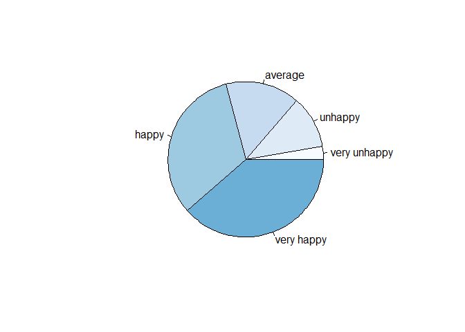
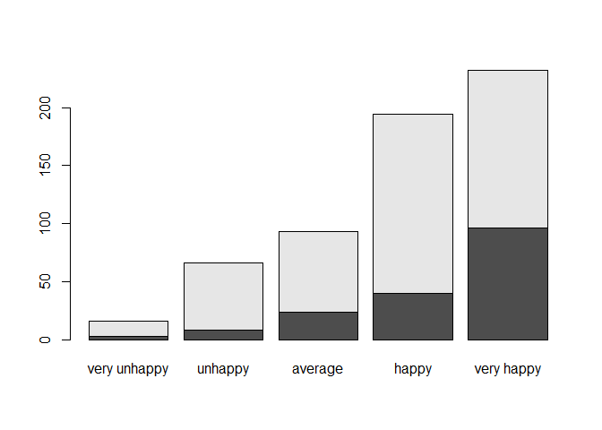
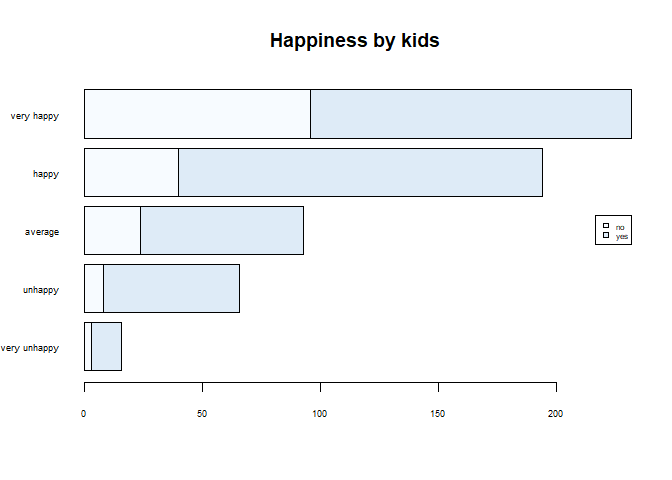
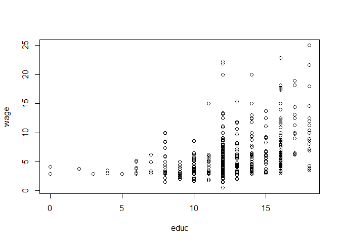
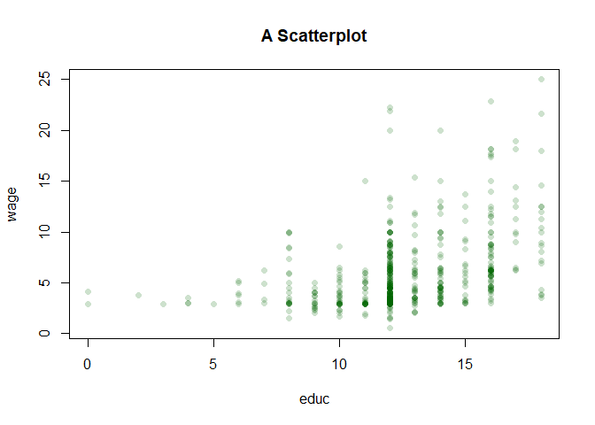

<style type="text/css"> 
body{
  font-size: 12pt;
}
code.r{
  font-size: 12pt;
}
</style>


<br/>
<br/>


# Data Frames

A data frame is similar to a rectangular spreadsheet where rows represent observations and columns represents variables (or features). In some ways, it is also similar to a matrix, but a data frame can contain different types of variables in the columns (string, numeric, etc.) whereas a matrix can contain only one type. As an example, suppose we have the following sales records on three different product: 


```r
year <- c(2008:2013)
product1 <- c(0,3,6,9,7,8)
product2 <- c(1,2,3,5,9,6)
product3 <- c(2,4,4,2,3,2)
```

Now, let's create a data frame using `data.frame()`

```r
sales <- data.frame(year, product1, product2, product3)
sales
```

```
##   year product1 product2 product3
## 1 2008        0        1        2
## 2 2009        3        2        4
## 3 2010        6        3        4
## 4 2011        9        5        2
## 5 2012        7        9        3
## 6 2013        8        6        2
```

```r
str(sales)
```

```
## 'data.frame':	6 obs. of  4 variables:
##  $ year    : int  2008 2009 2010 2011 2012 2013
##  $ product1: num  0 3 6 9 7 8
##  $ product2: num  1 2 3 5 9 6
##  $ product3: num  2 4 4 2 3 2
```

The data frame `sales` has 6 observations on 4 variables. Note that variable types (int, num) are also shown in the `str()` output above. You can also use `View(sales)` command to see the contents of the data set. 

Suppose that we want to export our data frame and save it as  a `csv` file (comma separated value). We can use `write.csv()` function for that as follows 

```r
write.csv(sales, file = "../Data/mydata.csv", row.names = FALSE)
```

Note that the file will be saved in the current directory. To see your current directory use `getwd()` and change it using `setwd("put your address here")`. 

Alternatively, we can use `write.table()` function to export it into `txt` or `csv` formats: 

```r
# text 
write.table(sales, file = "../Data/mydatatxt.txt", sep = " ", row.names = FALSE)
# csv without row or col names: 
write.table(sales, file = "../Data/mydatacsv.csv", sep = ",", row.names = FALSE, col.names = FALSE)
```

How about Excel format? For this we can install the package `writexl`:

```r
library(writexl)
write_xlsx(sales, path = "../Data/mydataxlsx.xlsx", col_names = FALSE)
```

Note that the column names can be preserved by changing the `col_names` option to `TRUE`.  

# Importing Data from Text, csv, and Excel files 

`read.table()` command enables `R` to read text files and then to store them as data frames. The option `header = TRUE` imports the first line as the variable names. The `sep=" "` option specifies the arguments like spaces, tabs and comma that separate the columns.

In the previous section, we saved a few data files in various formats. Now suppose that we want to import them into our `R` environment.  
Let's start with the file `mydatatxt.txt` which includes a header (variable names). We can use `read.table()` to read the data: 

```r
sales2 <- read.table("../Data/mydatatxt.txt", header = TRUE)
sales2
```

```
##   year product1 product2 product3
## 1 2008        0        1        2
## 2 2009        3        2        4
## 3 2010        6        3        4
## 4 2011        9        5        2
## 5 2012        7        9        3
## 6 2013        8        6        2
```

The same data are contained in `mydatacsv.csv` file separated by a comma and without header: 

```r
sales3 <- read.table("../Data/mydatacsv.csv", sep = ",")
sales3
```

```
##     V1 V2 V3 V4
## 1 2008  0  1  2
## 2 2009  3  2  4
## 3 2010  6  3  4
## 4 2011  9  5  2
## 5 2012  7  9  3
## 6 2013  8  6  2
```

Note that column names in the `sales3` data frame are automatically generated as `V1, V2, V3, V4`. We can change the column names as follows: 

```r
colnames(sales3) <- c("year", "prod1", "prod2", "prod3")
sales3
```

```
##   year prod1 prod2 prod3
## 1 2008     0     1     2
## 2 2009     3     2     4
## 3 2010     6     3     4
## 4 2011     9     5     2
## 5 2012     7     9     3
## 6 2013     8     6     2
```

 
To import excel files following command may be helpful.


```r
library(readxl)
sales4 <- read_xlsx("../Data/mydataxlsx.xlsx", col_names = FALSE) 
sales4
```

```
## # A tibble: 6 x 4
##    ...1  ...2  ...3  ...4
##   <dbl> <dbl> <dbl> <dbl>
## 1  2008     0     1     2
## 2  2009     3     2     4
## 3  2010     6     3     4
## 4  2011     9     5     2
## 5  2012     7     9     3
## 6  2013     8     6     2
```
We note that the `read_xlsx()` command produces a `tibble` instead of a data frame. A `tibble` is the same as a data frame but it may be more flexible (more on this later). 

# Creating a new variable

Once we have our data frame or tibble, we can easily create new variables using the 
assignment operator `<-` is used to create new variables. We note that the equality sign also works but we prefer using `<-`. For instance, we can create a new varible containing total sales in the  `sales` data frame which we created above.


```r
sales$total <- sales$product1 + sales$product2 + sales$product3 
sales
```

```
##   year product1 product2 product3 total
## 1 2008        0        1        2     3
## 2 2009        3        2        4     9
## 3 2010        6        3        4    13
## 4 2011        9        5        2    16
## 5 2012        7        9        3    19
## 6 2013        8        6        2    16
```

If there are missing observations in the data frame, then the resulting new variables will also be missing (`NA`). 

We can add a new variable `cat` to categorize total sales value as `high` or `low.`

```r
sales$cat <- "low"            # all values set to "low"
cat_ind <- sales$total>15     # logical variable
sales$cat[cat_ind] <- "high"  # change rows to "high" if cat_ind = TRUE
sales
```

```
##   year product1 product2 product3 total  cat
## 1 2008        0        1        2     3  low
## 2 2009        3        2        4     9  low
## 3 2010        6        3        4    13  low
## 4 2011        9        5        2    16 high
## 5 2012        7        9        3    19 high
## 6 2013        8        6        2    16 high
```

# Missing values and dropping observations

Sometimes data sets may not be complete and include missing values. Missing values are displayed as `NA` (not available) in `R`. Consider the following data frame:


```r
name <- c("firm1", "firm2", "firm3")
prod1 <- c(100, 150, NA)
prod2 <- c(90, 75, 100)
prod3 <- c(110, NA, 150)
prod_data<-data.frame(name, prod1, prod2, prod3)
prod_data
```

```
##    name prod1 prod2 prod3
## 1 firm1   100    90   110
## 2 firm2   150    75    NA
## 3 firm3    NA   100   150
```

We can identify missing values in the data set with the help of `is.na()` function.

```r
is.na(prod_data)
```

```
##       name prod1 prod2 prod3
## [1,] FALSE FALSE FALSE FALSE
## [2,] FALSE FALSE FALSE  TRUE
## [3,] FALSE  TRUE FALSE FALSE
```

If we want to drop the variables having missing values `na.omit()` can be used.

```r
na.omit(prod_data)
```

```
##    name prod1 prod2 prod3
## 1 firm1   100    90   110
```
 
In order to drop a variable, we can use logical subscripting and declare the column numbers with a `-` sign in front of them. For example, suppose we want to drop prod1 (second column) and prod3 (fourth column), we can use 

```r
newpd<- prod_data[c(-2, -4)]
newpd
```

```
##    name prod2
## 1 firm1    90
## 2 firm2    75
## 3 firm3   100
```


To remove a row following command may be used.


```r
newpd2<- prod_data[c(-2), ]
newpd2
```

```
##    name prod1 prod2 prod3
## 1 firm1   100    90   110
## 3 firm3    NA   100   150
```

If we want to create a subset of the sample `subset()` command may be useful.


```r
## A subset including prod1 and prod3 variables under the prod2<100 constraint.
subdata <- subset(prod_data, prod2<100, select=c(name, prod1, prod3))
subdata
```

```
##    name prod1 prod3
## 1 firm1   100   110
## 2 firm2   150    NA
```

If we want to change the value of the observations, we may use

```r
## Changing the value equaling to 100 in the variable prod1 in prod_data.
prod_data$prod1[prod_data$prod1==100] <- 999
prod_data
```

```
##    name prod1 prod2 prod3
## 1 firm1   999    90   110
## 2 firm2   150    75    NA
## 3 firm3    NA   100   150
```


We sometimes need to handle missing values. In this case `==` does not work.

```r
## Changing NAs in prod1 by 100.
prod_data$prod1[is.na(prod_data$prod1)] <- 100
prod_data
```

```
##    name prod1 prod2 prod3
## 1 firm1   999    90   110
## 2 firm2   150    75    NA
## 3 firm3   100   100   150
```

In some data sets, missing values may be given by numerical values like '999'. In such cases, we can assign `NA` to these observations.

```r
prod_data$prod1[prod_data$prod1==999] <- NA
prod_data
```

```
##    name prod1 prod2 prod3
## 1 firm1    NA    90   110
## 2 firm2   150    75    NA
## 3 firm3   100   100   150
```

# Descriptive statistics

Let us use `wage1` data set from the `wooldridge` package. If you have not done so, you should first install the package and then type

```r
# install wooldridge package first 
# and then run
library(wooldridge)
data(wage1)
head(wage1)
```

```
##   wage educ exper tenure nonwhite female married numdep smsa northcen south
## 1 3.10   11     2      0        0      1       0      2    1        0     0
## 2 3.24   12    22      2        0      1       1      3    1        0     0
## 3 3.00   11     2      0        0      0       0      2    0        0     0
## 4 6.00    8    44     28        0      0       1      0    1        0     0
## 5 5.30   12     7      2        0      0       1      1    0        0     0
## 6 8.75   16     9      8        0      0       1      0    1        0     0
##   west construc ndurman trcommpu trade services profserv profocc clerocc
## 1    1        0       0        0     0        0        0       0       0
## 2    1        0       0        0     0        1        0       0       0
## 3    1        0       0        0     1        0        0       0       0
## 4    1        0       0        0     0        0        0       0       1
## 5    1        0       0        0     0        0        0       0       0
## 6    1        0       0        0     0        0        1       1       0
##   servocc    lwage expersq tenursq
## 1       0 1.131402       4       0
## 2       1 1.175573     484       4
## 3       0 1.098612       4       0
## 4       0 1.791759    1936     784
## 5       0 1.667707      49       4
## 6       0 2.169054      81      64
```

You can access individual variables using `dataframe$variablename` syntax. For example, to compute the sample average of wage in the sample we can use 

```r
mean(wage1$wage)
```

```
## [1] 5.896103
```

The average hourly wage in the sample is about USD5.90. To compute the 5-number summary
statistics:  

```r
summary(wage1$wage)
```

```
##    Min. 1st Qu.  Median    Mean 3rd Qu.    Max. 
##   0.530   3.330   4.650   5.896   6.880  24.980
```

The median average wage is USD 4.65, less than the sample mean. This implies that the wage distribution is skewed to right (see the graphs below). 

We can access columns of the data frame using the `attach` command: 

```r
attach(wage1)
summary(educ)
```

```
##    Min. 1st Qu.  Median    Mean 3rd Qu.    Max. 
##    0.00   12.00   12.00   12.56   14.00   18.00
```

List of commands for sample statistics: 

Mean:	`mean()`

Standard deviation:	`sd()`

Variance:	`var()`

Minimum:	`min()`

Maximum:	`max()`

Median:	`median()`

Range of values (minimum and maximum):	`range()`

Sample quantiles:	`quantile()`
 
Interquartile range: 	`IQR()`

We can use `sapply()` function to compute a statistic for each column in a data frame. 
For example, 

```r
sapply(wage1[, 1:6], mean)
```

```
##       wage       educ      exper     tenure   nonwhite     female 
##  5.8961027 12.5627376 17.0171103  5.1045627  0.1026616  0.4790875
```

Note that we computed sample average for the first six columns of `wage1` data set. 
As another example, suppose that we want to compute the quantiles for wage, educ, and exper: 

```r
sapply(wage1[, 1:3], quantile)
```

```
##       wage educ exper
## 0%    0.53    0   1.0
## 25%   3.33   12   5.0
## 50%   4.65   12  13.5
## 75%   6.88   14  26.0
## 100% 24.98   18  51.0
```

**Exercises:** What is the proportion of male workers in the sample? 
Prepare a table of summary statistics for education. 
Prepare a Cross-table of mean wages across gender. Do the same for education. 

# Visualization: Descriptive Graphs

## Histogram  


```r
hist(wage) 
```

<!-- -->

Wage distribution is skewed to right (in other words, right tail is longer than left tail).

Here is the histogram of logarithmic wages: 

```r
hist(log(wage))
```

<!-- -->

Histogram of `log(wage)` is more symmetric. 

Histogram of educ: 

```r
hist(educ) 
```

<!-- -->


Smoothed histogram 

```r
hist(wage, freq = FALSE, ylim = c(0, 0.25), xlim = c(0,20))
lines(density(wage))
```

<!-- -->

There are several alternatives to base R graphs. For example, you can use `ggpubr` package which is based on `ggplot2`. 


```r
library(ggpubr)
gghistogram(log(wage), add = "mean")
```

<!-- -->


## Box plot


```r
boxplot(wage, horizontal=TRUE)
```

<!-- -->


Box plot should be interpreted with Tukey's 5-number summary, i.e., 

```r
# min Q1 median Q3 max
fivenum(wage)
```

```
## [1]  0.53  3.33  4.65  6.88 24.98
```

```r
summary(wage)
```

```
##    Min. 1st Qu.  Median    Mean 3rd Qu.    Max. 
##   0.530   3.330   4.650   5.896   6.880  24.980
```

We can draw box plot of wage across gender (1=female, 0=male)

```r
boxplot(wage ~ female, horizontal=TRUE)
```

<!-- -->

Here is the logarithmic version: 

```r
boxplot(log(wage) ~ female, horizontal=TRUE)
```

<!-- -->

**Exercise**. What is the percentage difference in average wages between men and women? 

## Categorical Variables

We can prepare a frequency distribution or for categorical variables using `table()`  command. In order to get _shares_ instead of _counts_ we may use `prop.table(table())` command.

```r
## Load affairs data from Wooldridge package.
data(affairs)
head(affairs)
```

```
##   id male age yrsmarr kids relig educ occup ratemarr naffairs affair vryhap
## 1  4    1  37    10.0    0     3   18     7        4        0      0      0
## 2  5    0  27     4.0    0     4   14     6        4        0      0      0
## 3  6    1  27     1.5    0     3   18     4        4        3      1      0
## 4 11    0  32    15.0    1     1   12     1        4        0      0      0
## 5 12    0  27     4.0    1     3   17     1        5        3      1      1
## 6 16    1  57    15.0    1     5   18     6        5        0      0      1
##   hapavg avgmarr unhap vryrel smerel slghtrel notrel
## 1      1       0     0      0      0        1      0
## 2      1       0     0      0      1        0      0
## 3      1       0     0      0      0        1      0
## 4      1       0     0      0      0        0      0
## 5      0       0     0      0      0        1      0
## 6      0       0     0      1      0        0      0
```

There are several categorical variables in the data set. In `R` we can define these as factor variables as follows: 

```r
## Label factor variables "kids" and "ratemarr".
kidslab <- c("no", "yes")
marrlab <- c("very unhappy", "unhappy", "average", "happy", "very happy")

haskid <- factor(affairs$kids, labels = kidslab)
marriage <- factor(affairs$ratemarr, labels = marrlab)
```


```r
## Frequencies for having kids.
table(haskid)
```

```
## haskid
##  no yes 
## 171 430
```


```r
## Share of marriage ratings.
prop.table(table(marriage))
```

```
## marriage
## very unhappy      unhappy      average        happy   very happy 
##    0.0266223    0.1098170    0.1547421    0.3227953    0.3860233
```


### Pie chart


```r
## Pie chart of marriage rating.
pie(table(marriage), col = blues9)
```

<!-- -->

### Bar plot


```r
## Bar plot of marriage rating 
barplot(table(marriage))
```

<!-- -->


```r
## Bar plot of marriage rating by kids
barplot(table(haskid, marriage))
```

<!-- -->


```r
## Bar plot of marriage rating by kids.
barplot(table(haskid, marriage), horiz = TRUE, las=1, legend=TRUE, cex.names=0.55,
        cex.axis = 0.55, args.legend =list(x="right", cex=0.5), col = blues9,
        main = "Happiness by kids")
```

<!-- -->

## Empirical CDF (cumulative density function)
ECDF is the fraction of observations which are less than or equal to some predetermined values within a variable. To plot ECDF __plot(ecdf())__ is used.
For instance, the graph of the ECDF of _wage_ variable may be drawn as follow.


<!-- -->
 
## Scatter Plot

Scatter plot of wage and educ: 

```r
plot(educ, wage) 
```

<!-- -->


Another scatter plot with transparency and high density: 

```r
plot(educ,wage, main="A Scatterplot", col=rgb(0,100,0,50,maxColorValue=255), pch=16)
```

<!-- -->


What is the sample correlation between wage and years of education: 

```r
cor(wage,educ)
```

```
## [1] 0.4059033
```


# Conditional Execution
If we want to run our code under certain conditions we can use `if` `else` statements. The usage is as follows: 

```r
if (condition) {
  code fragment
} else {
    code fragment
  }
```

For example, 

```r
a <- seq(1,10,1)
b <- 85
c <- "YTU"
if (typeof(b)=="double" |  typeof(b)=="integer") {
  print(b) } else {
    print("This is not a numeric object")
  }
```

```
## [1] 85
```

```r
x <- -10
if ( x < 0 ) {
  print("x is a negative number") } else {
    print("x is a positive number")
  }
```

```
## [1] "x is a negative number"
```

# Loops
We can easily execute repeated computation using `for` loop. The usage as follows:  

```r
for (loopvar in vector) { 
  }
```

The loop variable(`loopvar`) takes each value in the specified `vector`, one after another. For example,  

```r
for (i in 1:5) { 
  print(i) 
  }
```

The following example will take each element in the sequence of 1:10 and produce the square or square root of the element, depending on whether it is less than 5.

```r
for (i in 1:10){
  if (i<5) {print(i^2)}
  else {print(sqrt(i))}
}
```

```
## [1] 1
## [1] 4
## [1] 9
## [1] 16
## [1] 2.236068
## [1] 2.44949
## [1] 2.645751
## [1] 2.828427
## [1] 3
## [1] 3.162278
```
 


# Resources 

Basic R: [Swirl](https://swirlstats.com/students.html)

[RStudio Beginners Starting Point](https://education.rstudio.com/learn/beginner/)

Datacamp course: Introduction to R. (assignment) 


<div class="tocify-extend-page" data-unique="tocify-extend-page" style="height: 0;"></div>

