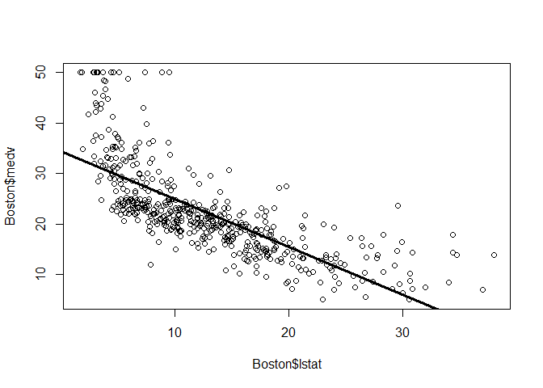
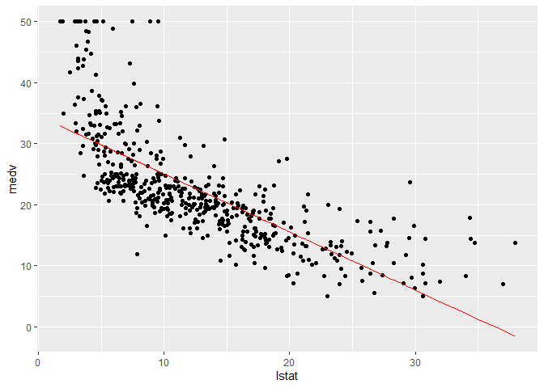
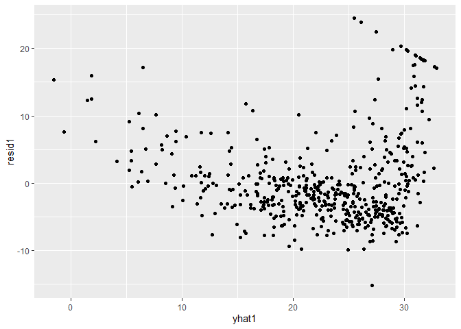
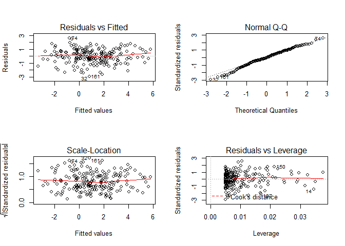
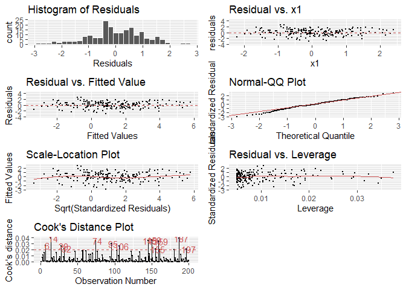
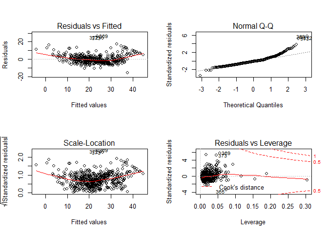
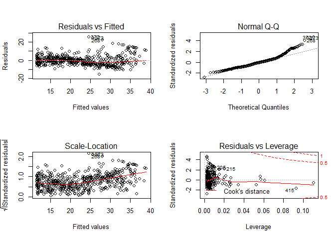
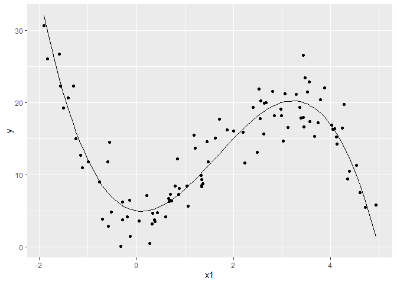
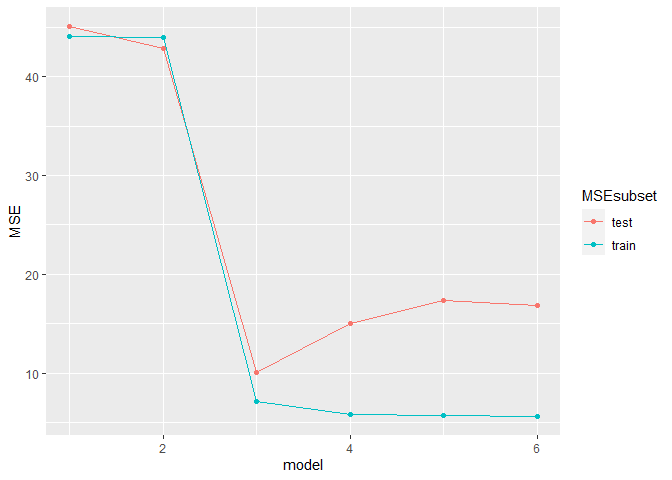

<style type="text/css"> 
body{
  background-color: #FAFAFA;
  font-size: 18px;
  line-height: 1.8; 
}
code.r{
  font-size: 12pt;
}
</style>


<br/>
<br/>


# Regression Basics

The purpose of machine learning is to predict  an outcome variable, $y$, given a set of features (covariates), $x_1,x_2,\ldots,x_p$. We can represent our prediction model using the following 
equation: 
$$
y = f(x_1, x_2, \ldots,x_p)+\epsilon
$$
where $f(\cdot)$ is some function and $\epsilon$ is an unobservable random error term. The prediction based on a given set of features can be written as 
$$
\hat{y}=f(x_1, x_2, \ldots,x_p)
$$
This framework is familiar to the students of econometrics. If we assume that the prediction function is linear we obtain
$$
y = \beta_0 + \beta_1 x_1 + \beta_2x_2 \ldots + \beta_p x_p +\epsilon
$$
which is the familiar linear regression model.

The Ordinary Least Squares (OLS) estimation works fine if the number of features is relatively small.  

## `lm()` function in base R 

Example from the ISLR text: 


```r
library(MASS)
library(ISLR)
library(tidyverse)

# Simple Linear Regression
# Boston house data set
names(Boston) 
```

```
##  [1] "crim"    "zn"      "indus"   "chas"    "nox"     "rm"      "age"    
##  [8] "dis"     "rad"     "tax"     "ptratio" "black"   "lstat"   "medv"
```

```r
# see the explanation of the variables
# ?Boston
```

Run the regression of `medv` (median house value in \$1000) on lower income status

```r
reg1 = lm(formula = medv ~ lstat, data=Boston) 
summary(reg1)
```

```
## 
## Call:
## lm(formula = medv ~ lstat, data = Boston)
## 
## Residuals:
##     Min      1Q  Median      3Q     Max 
## -15.168  -3.990  -1.318   2.034  24.500 
## 
## Coefficients:
##             Estimate Std. Error t value Pr(>|t|)    
## (Intercept) 34.55384    0.56263   61.41   <2e-16 ***
## lstat       -0.95005    0.03873  -24.53   <2e-16 ***
## ---
## Signif. codes:  0 '***' 0.001 '**' 0.01 '*' 0.05 '.' 0.1 ' ' 1
## 
## Residual standard error: 6.216 on 504 degrees of freedom
## Multiple R-squared:  0.5441,	Adjusted R-squared:  0.5432 
## F-statistic: 601.6 on 1 and 504 DF,  p-value: < 2.2e-16
```

```r
names(reg1)
```

```
##  [1] "coefficients"  "residuals"     "effects"       "rank"         
##  [5] "fitted.values" "assign"        "qr"            "df.residual"  
##  [9] "xlevels"       "call"          "terms"         "model"
```

```r
coef(reg1)
```

```
## (Intercept)       lstat 
##  34.5538409  -0.9500494
```

We can also use `tidy()`, `glance()` and `augment()` functions from the `broom` package to summarize the results and create separate data frames: 

```r
library(broom)
tidy(reg1)
```

```
## # A tibble: 2 x 5
##   term        estimate std.error statistic   p.value
##   <chr>          <dbl>     <dbl>     <dbl>     <dbl>
## 1 (Intercept)   34.6      0.563       61.4 3.74e-236
## 2 lstat         -0.950    0.0387     -24.5 5.08e- 88
```

```r
glance(reg1)
```

```
## # A tibble: 1 x 11
##   r.squared adj.r.squared sigma statistic  p.value    df logLik   AIC   BIC
##       <dbl>         <dbl> <dbl>     <dbl>    <dbl> <int>  <dbl> <dbl> <dbl>
## 1     0.544         0.543  6.22      602. 5.08e-88     2 -1641. 3289. 3302.
## # ... with 2 more variables: deviance <dbl>, df.residual <int>
```


```r
augment(reg1)
```

```
## # A tibble: 506 x 9
##     medv lstat .fitted .se.fit .resid    .hat .sigma     .cooksd .std.resid
##    <dbl> <dbl>   <dbl>   <dbl>  <dbl>   <dbl>  <dbl>       <dbl>      <dbl>
##  1  24    4.98   29.8    0.406 -5.82  0.00426   6.22 0.00189        -0.939 
##  2  21.6  9.14   25.9    0.308 -4.27  0.00246   6.22 0.000582       -0.688 
##  3  34.7  4.03   30.7    0.433  3.97  0.00486   6.22 0.00100         0.641 
##  4  33.4  2.94   31.8    0.467  1.64  0.00564   6.22 0.000198        0.264 
##  5  36.2  5.33   29.5    0.396  6.71  0.00406   6.21 0.00238         1.08  
##  6  28.7  5.21   29.6    0.399 -0.904 0.00413   6.22 0.0000440      -0.146 
##  7  22.9 12.4    22.7    0.276  0.155 0.00198   6.22 0.000000620     0.0250
##  8  27.1 19.2    16.4    0.374 10.7   0.00362   6.20 0.00544         1.73  
##  9  16.5 29.9     6.12   0.724 10.4   0.0136    6.20 0.0194          1.68  
## 10  18.9 17.1    18.3    0.326  0.592 0.00274   6.22 0.0000125       0.0954
## # ... with 496 more rows
```

Note that `augment()` creates a data frame that contains both observed variables and fitted values so that we can inspect the fit of the model directly. 

  

Compute the 95% confidence interval: 

```r
# 95% confidence interval 
confint(reg1)
```

```
##                 2.5 %     97.5 %
## (Intercept) 33.448457 35.6592247
## lstat       -1.026148 -0.8739505
```


Compute average predictions for a given set of lstat values: 

```r
# predictions from the model reg1
predict(reg1, data.frame(lstat=(c(5,10,15))), interval="confidence")
```

```
##        fit      lwr      upr
## 1 29.80359 29.00741 30.59978
## 2 25.05335 24.47413 25.63256
## 3 20.30310 19.73159 20.87461
```

Compute predictions for single observations: 

```r
# predictions from the model reg1 
# for a single observation
predict(reg1, data.frame(lstat=(c(5,10,15))), interval="prediction")
```

```
##        fit       lwr      upr
## 1 29.80359 17.565675 42.04151
## 2 25.05335 12.827626 37.27907
## 3 20.30310  8.077742 32.52846
```

Graph of fitted values: 

```r
plot(Boston$lstat, Boston$medv) 
abline(reg1,lwd=3)
```

<!-- -->

Or, alternatively,

```r
# create a new data frame and call it Boston1
# I don't want to modify the original data set
Boston1 <- Boston
Boston1$yhat1 <- predict(reg1, Boston1)

Boston1 %>% ggplot(aes(lstat, medv)) + 
  geom_point() + 
  geom_line(aes(lstat, yhat1, color="red")) +
  theme(legend.position = "none") 
```

<!-- -->

An alternative is to use the `augment()` function from the  `broom` package (loaded above): 

```r
augment(reg1) %>% 
  ggplot(mapping = aes(x = lstat)) +
  geom_point(mapping = aes(y = medv)) +
  geom_line(mapping = aes(y = .fitted), color = "red")
```

<!-- -->

It seems that there are some kind of nonlinearity in the relationship that cannot be captured in the regression above. Plotting the residuals and predicted values we obtain: 

```r
# Residuals vs Fitted values plot
Boston1$resid1 <- residuals(reg1)

Boston1 %>% ggplot(aes(yhat1, resid1)) + 
  geom_point() 
```

<!-- -->

We expect the residuals to be dispersed around zero randomly. But the graph above indicates that there are same patterns not captured in the estimated relationship. 

Diagnostic plots can easily be obtained after the `lm()` estimation: 

```r
par(mfrow=c(2,2))
plot(reg1)
```

<!-- -->

The first graph (up left) is the residuals vs fitted graph which we just discussed. The second graph (up right) is Q-Q plot of the standardized residuals which displays deviations from the normality. If the standardized residuals are normally distributed, they should be close to the dashed line. We see that there are some deviations on the upper left tail of the distribution (draw the histogram of the residuals to see this). 

The third grap (lower left) is the scale-location graph for the residuals and fitted values. We have square root of the absolute standardized residuals on the vertical axis. Again, we expect a random dispersion without any visible pattern that may be indicative of heteroscedasticity. The picture above suggests that the residual variance is more or less constant. 

The fourth graph (lower right) is the leverage graph. This may be useful to diagnose influential observations (outliers that may affect the regression output). In this graph, we particularly focus on the upper right and lower right corners for the existence of influential observations. The picture also includes dashed lines (Cook's distance). Any observations falling outside the the Cook's distance may be treated as influential. The graph above suggests that there are no influential observations. 


Here is a simulated simple regression together with diagnostic pictures. 

```r
set.seed(1) # for replication
n   <- 200
x1  <- rnorm(n, mean=0, sd=1) 
y   <- 1 + 2*x1 + rnorm(n, mean=0, sd=1)
df1 <- tibble(id=1:n, y, x1)
reg_df1 <- lm(y ~ x1, data = df1)
# diagnostic plots
par(mfrow=c(2,2))
plot(reg_df1)
```

<!-- -->

An alternative diagnostic plot tool that uses `ggplot`: 

```r
# diagnostics using lindia package 
library(lindia)
reg_df1 %>% gg_diagnose(plot.all=TRUE)
```

<!-- -->

# Multiple Linear Regression 

The Boston house value data set includes several features. To include all the 
variables in the regression we can use the following command: 

```r
reg2 <- lm(medv ~ . , data = Boston)
summary(reg2)
```

```
## 
## Call:
## lm(formula = medv ~ ., data = Boston)
## 
## Residuals:
##     Min      1Q  Median      3Q     Max 
## -15.595  -2.730  -0.518   1.777  26.199 
## 
## Coefficients:
##               Estimate Std. Error t value Pr(>|t|)    
## (Intercept)  3.646e+01  5.103e+00   7.144 3.28e-12 ***
## crim        -1.080e-01  3.286e-02  -3.287 0.001087 ** 
## zn           4.642e-02  1.373e-02   3.382 0.000778 ***
## indus        2.056e-02  6.150e-02   0.334 0.738288    
## chas         2.687e+00  8.616e-01   3.118 0.001925 ** 
## nox         -1.777e+01  3.820e+00  -4.651 4.25e-06 ***
## rm           3.810e+00  4.179e-01   9.116  < 2e-16 ***
## age          6.922e-04  1.321e-02   0.052 0.958229    
## dis         -1.476e+00  1.995e-01  -7.398 6.01e-13 ***
## rad          3.060e-01  6.635e-02   4.613 5.07e-06 ***
## tax         -1.233e-02  3.760e-03  -3.280 0.001112 ** 
## ptratio     -9.527e-01  1.308e-01  -7.283 1.31e-12 ***
## black        9.312e-03  2.686e-03   3.467 0.000573 ***
## lstat       -5.248e-01  5.072e-02 -10.347  < 2e-16 ***
## ---
## Signif. codes:  0 '***' 0.001 '**' 0.01 '*' 0.05 '.' 0.1 ' ' 1
## 
## Residual standard error: 4.745 on 492 degrees of freedom
## Multiple R-squared:  0.7406,	Adjusted R-squared:  0.7338 
## F-statistic: 108.1 on 13 and 492 DF,  p-value: < 2.2e-16
```

If we want to exclude a variable, say age, we can use: 

```r
reg3 <- lm(medv ~ . -age, data = Boston)
summary(reg3)
```

```
## 
## Call:
## lm(formula = medv ~ . - age, data = Boston)
## 
## Residuals:
##      Min       1Q   Median       3Q      Max 
## -15.6054  -2.7313  -0.5188   1.7601  26.2243 
## 
## Coefficients:
##               Estimate Std. Error t value Pr(>|t|)    
## (Intercept)  36.436927   5.080119   7.172 2.72e-12 ***
## crim         -0.108006   0.032832  -3.290 0.001075 ** 
## zn            0.046334   0.013613   3.404 0.000719 ***
## indus         0.020562   0.061433   0.335 0.737989    
## chas          2.689026   0.859598   3.128 0.001863 ** 
## nox         -17.713540   3.679308  -4.814 1.97e-06 ***
## rm            3.814394   0.408480   9.338  < 2e-16 ***
## dis          -1.478612   0.190611  -7.757 5.03e-14 ***
## rad           0.305786   0.066089   4.627 4.75e-06 ***
## tax          -0.012329   0.003755  -3.283 0.001099 ** 
## ptratio      -0.952211   0.130294  -7.308 1.10e-12 ***
## black         0.009321   0.002678   3.481 0.000544 ***
## lstat        -0.523852   0.047625 -10.999  < 2e-16 ***
## ---
## Signif. codes:  0 '***' 0.001 '**' 0.01 '*' 0.05 '.' 0.1 ' ' 1
## 
## Residual standard error: 4.74 on 493 degrees of freedom
## Multiple R-squared:  0.7406,	Adjusted R-squared:  0.7343 
## F-statistic: 117.3 on 12 and 493 DF,  p-value: < 2.2e-16
```

Also remove indus

```r
reg4 <- lm(medv ~ . -age -indus, data = Boston)
summary(reg4)
```

```
## 
## Call:
## lm(formula = medv ~ . - age - indus, data = Boston)
## 
## Residuals:
##      Min       1Q   Median       3Q      Max 
## -15.5984  -2.7386  -0.5046   1.7273  26.2373 
## 
## Coefficients:
##               Estimate Std. Error t value Pr(>|t|)    
## (Intercept)  36.341145   5.067492   7.171 2.73e-12 ***
## crim         -0.108413   0.032779  -3.307 0.001010 ** 
## zn            0.045845   0.013523   3.390 0.000754 ***
## chas          2.718716   0.854240   3.183 0.001551 ** 
## nox         -17.376023   3.535243  -4.915 1.21e-06 ***
## rm            3.801579   0.406316   9.356  < 2e-16 ***
## dis          -1.492711   0.185731  -8.037 6.84e-15 ***
## rad           0.299608   0.063402   4.726 3.00e-06 ***
## tax          -0.011778   0.003372  -3.493 0.000521 ***
## ptratio      -0.946525   0.129066  -7.334 9.24e-13 ***
## black         0.009291   0.002674   3.475 0.000557 ***
## lstat        -0.522553   0.047424 -11.019  < 2e-16 ***
## ---
## Signif. codes:  0 '***' 0.001 '**' 0.01 '*' 0.05 '.' 0.1 ' ' 1
## 
## Residual standard error: 4.736 on 494 degrees of freedom
## Multiple R-squared:  0.7406,	Adjusted R-squared:  0.7348 
## F-statistic: 128.2 on 11 and 494 DF,  p-value: < 2.2e-16
```

Regression diagnostics: 

```r
par(mfrow=c(2,2))
plot(reg4)
```

<!-- -->

These plots suggest that there is still some evidence of nonlinearity. 

## Interaction Effects  

To add the interaction between `lstat` and `age` we can just use 

```r
reg5 <- lm(medv ~ lstat * age, data = Boston)
summary(reg5)
```

```
## 
## Call:
## lm(formula = medv ~ lstat * age, data = Boston)
## 
## Residuals:
##     Min      1Q  Median      3Q     Max 
## -15.806  -4.045  -1.333   2.085  27.552 
## 
## Coefficients:
##               Estimate Std. Error t value Pr(>|t|)    
## (Intercept) 36.0885359  1.4698355  24.553  < 2e-16 ***
## lstat       -1.3921168  0.1674555  -8.313 8.78e-16 ***
## age         -0.0007209  0.0198792  -0.036   0.9711    
## lstat:age    0.0041560  0.0018518   2.244   0.0252 *  
## ---
## Signif. codes:  0 '***' 0.001 '**' 0.01 '*' 0.05 '.' 0.1 ' ' 1
## 
## Residual standard error: 6.149 on 502 degrees of freedom
## Multiple R-squared:  0.5557,	Adjusted R-squared:  0.5531 
## F-statistic: 209.3 on 3 and 502 DF,  p-value: < 2.2e-16
```

Note that all variables are automatically included. Alternatively we can use 


```r
reg6 <- lm(medv ~ lstat + age + lstat:age, data = Boston)
summary(reg6)
```

```
## 
## Call:
## lm(formula = medv ~ lstat + age + lstat:age, data = Boston)
## 
## Residuals:
##     Min      1Q  Median      3Q     Max 
## -15.806  -4.045  -1.333   2.085  27.552 
## 
## Coefficients:
##               Estimate Std. Error t value Pr(>|t|)    
## (Intercept) 36.0885359  1.4698355  24.553  < 2e-16 ***
## lstat       -1.3921168  0.1674555  -8.313 8.78e-16 ***
## age         -0.0007209  0.0198792  -0.036   0.9711    
## lstat:age    0.0041560  0.0018518   2.244   0.0252 *  
## ---
## Signif. codes:  0 '***' 0.001 '**' 0.01 '*' 0.05 '.' 0.1 ' ' 1
## 
## Residual standard error: 6.149 on 502 degrees of freedom
## Multiple R-squared:  0.5557,	Adjusted R-squared:  0.5531 
## F-statistic: 209.3 on 3 and 502 DF,  p-value: < 2.2e-16
```

## Nonlinear Transformations 

It's easy to add nonlinear transformations of variables such as quadratics, 
logs, higher order terms, etc. For example, to add quadratic terms we use 

```r
reg7 <- lm(medv ~ lstat + I(lstat^2), data = Boston)
summary(reg7)
```

```
## 
## Call:
## lm(formula = medv ~ lstat + I(lstat^2), data = Boston)
## 
## Residuals:
##      Min       1Q   Median       3Q      Max 
## -15.2834  -3.8313  -0.5295   2.3095  25.4148 
## 
## Coefficients:
##              Estimate Std. Error t value Pr(>|t|)    
## (Intercept) 42.862007   0.872084   49.15   <2e-16 ***
## lstat       -2.332821   0.123803  -18.84   <2e-16 ***
## I(lstat^2)   0.043547   0.003745   11.63   <2e-16 ***
## ---
## Signif. codes:  0 '***' 0.001 '**' 0.01 '*' 0.05 '.' 0.1 ' ' 1
## 
## Residual standard error: 5.524 on 503 degrees of freedom
## Multiple R-squared:  0.6407,	Adjusted R-squared:  0.6393 
## F-statistic: 448.5 on 2 and 503 DF,  p-value: < 2.2e-16
```

Quadratic term is statistically significant. To compare the fit of the 
quadratic fit and the linear fit we can just use `anova` function: 

```r
anova(reg1, reg7)
```

```
## Analysis of Variance Table
## 
## Model 1: medv ~ lstat
## Model 2: medv ~ lstat + I(lstat^2)
##   Res.Df   RSS Df Sum of Sq     F    Pr(>F)    
## 1    504 19472                                 
## 2    503 15347  1    4125.1 135.2 < 2.2e-16 ***
## ---
## Signif. codes:  0 '***' 0.001 '**' 0.01 '*' 0.05 '.' 0.1 ' ' 1
```

Note that reg1 (model1) is nested within reg7 (model2). This is the simple F test. 
The result suggest that model2 is superior. 

Let's check the residual diagnostics to see if there are still unmodeled nonlinearity: 

```r
par(mfrow=c(2,2))
plot(reg7)
```

<!-- -->


To add higher order polynomial terms, we can use `poly()` function within the `lm()` as follows. For example, to add the fifth order polynomial of lstat: 

```r
reg8 <- lm(medv ~ poly(lstat,5), data = Boston)
summary(reg8)
```

```
## 
## Call:
## lm(formula = medv ~ poly(lstat, 5), data = Boston)
## 
## Residuals:
##      Min       1Q   Median       3Q      Max 
## -13.5433  -3.1039  -0.7052   2.0844  27.1153 
## 
## Coefficients:
##                  Estimate Std. Error t value Pr(>|t|)    
## (Intercept)       22.5328     0.2318  97.197  < 2e-16 ***
## poly(lstat, 5)1 -152.4595     5.2148 -29.236  < 2e-16 ***
## poly(lstat, 5)2   64.2272     5.2148  12.316  < 2e-16 ***
## poly(lstat, 5)3  -27.0511     5.2148  -5.187 3.10e-07 ***
## poly(lstat, 5)4   25.4517     5.2148   4.881 1.42e-06 ***
## poly(lstat, 5)5  -19.2524     5.2148  -3.692 0.000247 ***
## ---
## Signif. codes:  0 '***' 0.001 '**' 0.01 '*' 0.05 '.' 0.1 ' ' 1
## 
## Residual standard error: 5.215 on 500 degrees of freedom
## Multiple R-squared:  0.6817,	Adjusted R-squared:  0.6785 
## F-statistic: 214.2 on 5 and 500 DF,  p-value: < 2.2e-16
```

## Qualitative Predictors
We can easily add qualitative (dummy variables) in the multiple regression. This example is from the ISLR textbook: 

```r
library(ISLR)
names(Carseats)
```

```
##  [1] "Sales"       "CompPrice"   "Income"      "Advertising" "Population" 
##  [6] "Price"       "ShelveLoc"   "Age"         "Education"   "Urban"      
## [11] "US"
```

```r
fit1 <- lm(Sales~ . + Income:Advertising + Price:Age, data=Carseats)
summary(fit1)
```

```
## 
## Call:
## lm(formula = Sales ~ . + Income:Advertising + Price:Age, data = Carseats)
## 
## Residuals:
##     Min      1Q  Median      3Q     Max 
## -2.9208 -0.7503  0.0177  0.6754  3.3413 
## 
## Coefficients:
##                      Estimate Std. Error t value Pr(>|t|)    
## (Intercept)         6.5755654  1.0087470   6.519 2.22e-10 ***
## CompPrice           0.0929371  0.0041183  22.567  < 2e-16 ***
## Income              0.0108940  0.0026044   4.183 3.57e-05 ***
## Advertising         0.0702462  0.0226091   3.107 0.002030 ** 
## Population          0.0001592  0.0003679   0.433 0.665330    
## Price              -0.1008064  0.0074399 -13.549  < 2e-16 ***
## ShelveLocGood       4.8486762  0.1528378  31.724  < 2e-16 ***
## ShelveLocMedium     1.9532620  0.1257682  15.531  < 2e-16 ***
## Age                -0.0579466  0.0159506  -3.633 0.000318 ***
## Education          -0.0208525  0.0196131  -1.063 0.288361    
## UrbanYes            0.1401597  0.1124019   1.247 0.213171    
## USYes              -0.1575571  0.1489234  -1.058 0.290729    
## Income:Advertising  0.0007510  0.0002784   2.698 0.007290 ** 
## Price:Age           0.0001068  0.0001333   0.801 0.423812    
## ---
## Signif. codes:  0 '***' 0.001 '**' 0.01 '*' 0.05 '.' 0.1 ' ' 1
## 
## Residual standard error: 1.011 on 386 degrees of freedom
## Multiple R-squared:  0.8761,	Adjusted R-squared:  0.8719 
## F-statistic:   210 on 13 and 386 DF,  p-value: < 2.2e-16
```

ShelveLoc is an indicator of the quality of the shelving location (bad, medium, good). 
Because ShelveLoc is defined as a factor variable, R automaticaly included dummy variables (one of the levels is used as the based group). 

```r
contrasts(Carseats$ShelveLoc)
```

```
##        Good Medium
## Bad       0      0
## Good      1      0
## Medium    0      1
```

# Comparing Training vs Test 

Let's go back to the Boston house data. We want to compare the prediction performance of two models, linear model vs quadratic model in terms of lstat. 

We split the sample into training part and test part randomly. To this end, we can use 
`sample()` function. 

```r
set.seed(1)
train <- sample(506, 253)
```
Note that `set.seed()` is required for replication. 
There are $n=506$ observations in the Boston house data set. A random half will be 
used in training (estimation) and the other half will be used in the testing. Note that 
`train` contains row numbers of the observations that are selected to be included in the training sample. More explicitly, we can create two data sets for training and testing from the Boston house data set: 

```r
train_Boston <- Boston[train,]
test_Boston <- Boston[-train,]
```

Note that, `-train` index only selects observations that are **not** in the training set. 
Now, we are ready to estimate our alternative models using only training data: 

```r
lfit <- lm(medv ~ lstat, data = train_Boston)
qfit <- lm(medv ~ lstat + I(lstat^2), data = train_Boston) 
```

We compute the predictions using only the test data set and then compare the alternative models using Mean Squared Error (MSE)


```r
lin_predict <- predict(lfit, test_Boston)
lin_error <- test_Boston$medv - lin_predict
MSE_lfit <- mean(lin_error^2)
MSE_lfit
```

```
## [1] 43.34683
```

Similarly, for the quadratic fit: 

```r
qu_predict <- predict(qfit, test_Boston)
qu_error <- test_Boston$medv - qu_predict
MSE_qfit <- mean(qu_error^2)
MSE_qfit
```

```
## [1] 36.126
```

The quadratic model has a much smaller MSE suggesting a more successful prediction model. 

# Test and Training MSE revisited 

Let us consider a simulation experiment in which we know the true relationship but estimate the model using different levels of complexity. 

```r
set.seed(1) # for replication
n   <- 100
x1  <- runif(n,-2,5)
f   <- -x1^3 + 5*x1^2 -x1 +5 
y   <- f + rnorm(n, mean=0, sd=3)
df <- tibble(id=1:n, y, x1)
head(df) 
```

```
## # A tibble: 6 x 3
##      id     y     x1
##   <int> <dbl>  <dbl>
## 1     1  6.44 -0.141
## 2     2  4.17  0.605
## 3     3 16.1   2.01 
## 4     4  9.45  4.36 
## 5     5 11.8  -0.588
## 6     6 19.7   4.29
```

```r
df %>% ggplot(aes(x=x1,y=y))+
  geom_point() +
  geom_line(aes(x1,f))
```

<!-- -->

Determine the training and test sets: 

```r
set.seed(1)
train_df <- sample(n,n/2)
# note that train_df contains observation numbers 
train_data <- df[train_df,]
test_data <- df[-train_df,]
```

We will estimate polynomial regressions upto order 6. 

```r
maxd = 6
trMSE = rep(0,maxd)
teMSE = rep(0,maxd)

for (i in 1:maxd) {
  trainfit <- lm(y ~ poly(x1, i), data=train_data)
  teMSE[i] <- mean((test_data$y - predict(trainfit, test_data) )^2)
  trMSE[i] <- mean(resid(trainfit)^2)
}
```


```r
MSE <- tibble(model=rep(1:maxd,2), 
              MSEsubset=rep(c("train","test"), each = maxd), 
              MSE=c(trMSE,teMSE))
MSE
```

```
## # A tibble: 12 x 3
##    model MSEsubset   MSE
##    <int> <chr>     <dbl>
##  1     1 train     44.1 
##  2     2 train     44.0 
##  3     3 train      7.08
##  4     4 train      5.76
##  5     5 train      5.65
##  6     6 train      5.65
##  7     1 test      45.1 
##  8     2 test      42.9 
##  9     3 test      10.1 
## 10     4 test      15.0 
## 11     5 test      17.3 
## 12     6 test      16.9
```

Graph of MSEs: 

```r
MSE %>% ggplot(aes(model,MSE, color=MSEsubset))+
  geom_point() + 
  geom_line() 
```

<!-- -->

As expected, training MSE keeps getting smaller as the order of the polynomial increases. On the other hand, test MSE is minimum at degree=3 and then increases. This suggests that the most successful prediction model is the one that includes third power (which is the true model). 


<div class="tocify-extend-page" data-unique="tocify-extend-page" style="height: 0;"></div>


