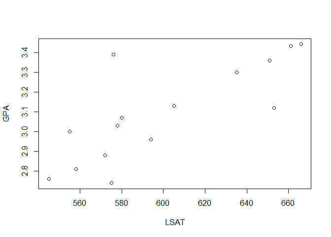
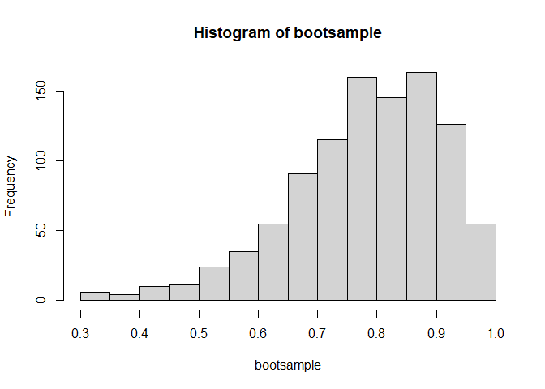

<br/>
<br/>


# Validation Set Approach 

This example is from the ISLR text. It uses the `auto` data set to estimate 
a linear regression model for fuel efficiency (mpg). 


```r
library(ISLR) 
# randomly select observations to be included
# in the training set
set.seed(1)
train <- sample(392,196)
```


```r
# Estimate the model using only training data
lmfit <- lm(mpg ~ horsepower,data = Auto, subset = train)
```


```r
# estimate the prediction error using only test data 
train_auto <- Auto[train,]
test_auto <- Auto[-train,]
train_predict <- predict(lmfit, train_auto)
test_predict <- predict(lmfit, test_auto)
test_error <- test_auto$mpg - test_predict
mean(test_error^2)
```

```
## [1] 23.26601
```

```r
#
# or in one line - but harder to grasp
# mean((Auto$mpg-predict(lmfit,Auto))[-train]^2)
```

Similarly, for quadratic and cubic regressions: 

```r
lm.fit2 <- lm(mpg~poly(horsepower,2),data=Auto,subset=train)
mean((Auto$mpg-predict(lm.fit2,Auto))[-train]^2)
```

```
## [1] 18.71646
```


```r
lm.fit3 <- lm(mpg~poly(horsepower,3),data=Auto,subset=train)
mean((Auto$mpg-predict(lm.fit3,Auto))[-train]^2)
```

```
## [1] 18.79401
```

Choose another validation set and compute MSE

```r
set.seed(2)
train <- sample(392,196)
lm.fit <- lm(mpg ~ horsepower, data=Auto, subset=train)
mean((Auto$mpg-predict(lm.fit,Auto))[-train]^2)
```

```
## [1] 25.72651
```


```r
lm.fit2 <- lm(mpg~poly(horsepower,2),data=Auto,subset=train)
mean((Auto$mpg-predict(lm.fit2,Auto))[-train]^2)
```

```
## [1] 20.43036
```


```r
lm.fit3 <- lm(mpg~poly(horsepower,3),data=Auto,subset=train)
mean((Auto$mpg-predict(lm.fit3,Auto))[-train]^2)
```

```
## [1] 20.38533
```

# Leave-one-out Cross-Validation (LOOCV)

In LOOCV we repeatedly estimate the model on the training set by leaving one observation out on at a time. We can use `cv.glm()` function which is a part of the `boot` library together with `glm()` function to perform linear regression. 

`glm()` function is similar to `lm()`: 

```r
glm.fit <- glm(mpg~horsepower,data=Auto)
coef(glm.fit)
```

```
## (Intercept)  horsepower 
##  39.9358610  -0.1578447
```

```r
lm.fit <- lm(mpg~horsepower,data=Auto)
coef(lm.fit)
```

```
## (Intercept)  horsepower 
##  39.9358610  -0.1578447
```

The usage of `cv.glm()`:

```r
library(boot)
glm.fit <- glm(mpg~horsepower, data=Auto)
cv.err <- cv.glm(Auto, glm.fit)
cv.err$delta
```

```
## [1] 24.23151 24.23114
```

`cv.err` contains cross-validation mean error (see equation 5.1 in the ISLR text). As the default, `cv.glm()` performs LOOCV. See below for K-fold Cross-Validation. 

Let's apply LOOCV for more complicated models (higher order polynomials) and compare the results: 


```r
cv.error=rep(0,5)
for (i in 1:5){
  glm.fit <- glm(mpg ~ poly(horsepower,i), data=Auto)
  cv.error[i] <- cv.glm(Auto, glm.fit)$delta[1]
}
cv.error
```

```
## [1] 24.23151 19.24821 19.33498 19.42443 19.03321
```

# K-fold Cross-Validation


```r
set.seed(17)
cv.error.10 <- rep(0,10)
for (i in 1:10){
  glm.fit <- glm(mpg ~ poly(horsepower,i), data = Auto)
  cv.error.10[i] <- cv.glm(Auto, glm.fit, K=10)$delta[1]
}
cv.error.10
```

```
##  [1] 24.27207 19.26909 19.34805 19.29496 19.03198 18.89781 19.12061 19.14666
##  [9] 18.87013 20.95520
```

# Bootstrap 

This example is from  Efron, B. and R. Tibshrani "Bootstrap Methods for Standard Errors, Confidence Intervals and Other measures of Statisical Accuracy." Statistical Science, 1(1986): 54-77.

The data set consists of average LSAT scores and GPAs from n=15 American law schools that are obtained for the 1973 entering class.  

```r
LSAT <- c(576, 635, 558, 578, 666, 580, 555, 661, 651, 605, 653, 575, 545, 572, 594)
GPA <- c(3.39, 3.30, 2.81, 3.03, 3.44, 3.07, 3.00, 3.43, 3.36, 3.13, 
        3.12, 2.74, 2.76, 2.88, 2.96)
data <- data.frame(LSAT,GPA)
plot(LSAT,GPA)
```

<!-- -->

We are interested in estimating the standard error of the correlation coefficient. 
The sample correlation coefficient between LSAT and GPA is 

```r
cor(LSAT,GPA)
```

```
## [1] 0.7763745
```

What is the bootstrap standard error? To answer this question, we need to repeatedly sample from the data set and estimate (and save) the sample correlation coefficients. In the following code chunk, we implement this using the `sample(n,n,replace=TRUE)` function in a loop over B bootstrap replications. 


```r
set.seed(111)
B <- 1000 
bootsample <- rep(0,B)
for (i in 1:B){
  index <- sample(15,15,replace = TRUE)
  bootsample[i] <- cor(LSAT[index], GPA[index])
}
hist(bootsample)
```

<!-- -->

```r
sqrt(var(bootsample))
```

```
## [1] 0.127539
```

```r
summary(bootsample)
```

```
##    Min. 1st Qu.  Median    Mean 3rd Qu.    Max. 
##  0.3128  0.7049  0.7955  0.7803  0.8772  0.9972
```

The bootstrap standard error estimate is 0.1275, practically the same as in the original publication. Efron and Tibshirani report a bootstrap standard error estimate of 0.127. 
Also, notice that the bootstrap mean is 0.7803, essentially the same as the sample correlation coefficient, 0.776. 


The `boot()` function automates this. But we first need to define a function 
that returns the "statisic" for a given bootstrap sample indicated by "index". See the 
help file for `boot()`.


```r
corboot <- function(data, index){
  X <- data[index,1]
  Y <- data[index,2]
  return(cor(X,Y))
}

library(boot)
set.seed(111)
boot(data = data, statistic = corboot, R=1000)
```

```
## 
## ORDINARY NONPARAMETRIC BOOTSTRAP
## 
## 
## Call:
## boot(data = data, statistic = corboot, R = 1000)
## 
## 
## Bootstrap Statistics :
##      original       bias    std. error
## t1* 0.7763745 0.0009153723   0.1311586
```


## Estimating the Accuracy of a Linear Regression Model


```r
boot.fn=function(data,index)
  return(coef(lm(mpg~horsepower,data=data,subset=index)))
boot.fn(Auto,1:392)
```

```
## (Intercept)  horsepower 
##  39.9358610  -0.1578447
```


```r
set.seed(1)
boot.fn(Auto,sample(392,392,replace=T))
```

```
## (Intercept)  horsepower 
##  40.3404517  -0.1634868
```

```r
boot.fn(Auto,sample(392,392,replace=T))
```

```
## (Intercept)  horsepower 
##  40.1186906  -0.1577063
```


```r
boot(Auto,boot.fn,1000)
```

```
## 
## ORDINARY NONPARAMETRIC BOOTSTRAP
## 
## 
## Call:
## boot(data = Auto, statistic = boot.fn, R = 1000)
## 
## 
## Bootstrap Statistics :
##       original        bias    std. error
## t1* 39.9358610  0.0544513229 0.841289790
## t2* -0.1578447 -0.0006170901 0.007343073
```

```r
summary(lm(mpg~horsepower,data=Auto))$coef
```

```
##               Estimate  Std. Error   t value      Pr(>|t|)
## (Intercept) 39.9358610 0.717498656  55.65984 1.220362e-187
## horsepower  -0.1578447 0.006445501 -24.48914  7.031989e-81
```


```r
boot.fn=function(data,index)
  coefficients(lm(mpg~horsepower+I(horsepower^2),data=data,subset=index))
set.seed(1)
boot(Auto,boot.fn,1000)
```

```
## 
## ORDINARY NONPARAMETRIC BOOTSTRAP
## 
## 
## Call:
## boot(data = Auto, statistic = boot.fn, R = 1000)
## 
## 
## Bootstrap Statistics :
##         original        bias     std. error
## t1* 56.900099702  3.511640e-02 2.0300222526
## t2* -0.466189630 -7.080834e-04 0.0324241984
## t3*  0.001230536  2.840324e-06 0.0001172164
```

```r
summary(lm(mpg~horsepower+I(horsepower^2),data=Auto))$coef
```

```
##                     Estimate   Std. Error   t value      Pr(>|t|)
## (Intercept)     56.900099702 1.8004268063  31.60367 1.740911e-109
## horsepower      -0.466189630 0.0311246171 -14.97816  2.289429e-40
## I(horsepower^2)  0.001230536 0.0001220759  10.08009  2.196340e-21
```


<div class="tocify-extend-page" data-unique="tocify-extend-page" style="height: 0;"></div>

