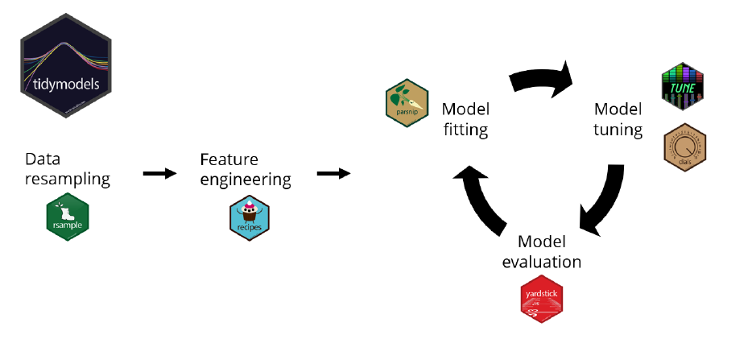
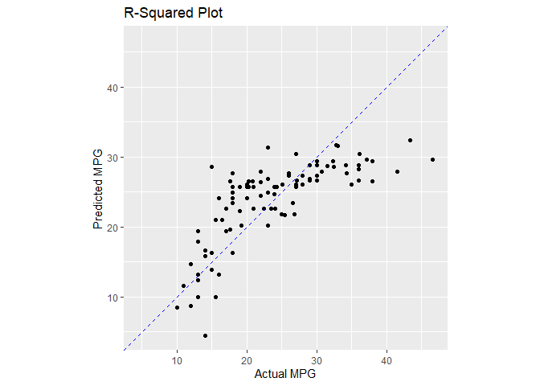
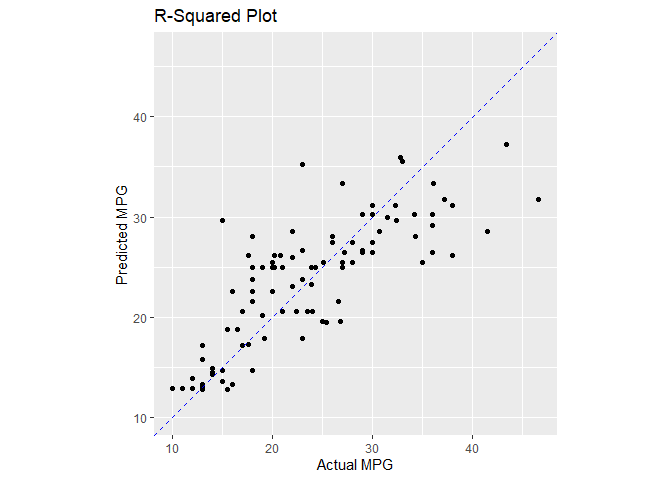

<style type="text/css"> 
body{
  background-color: #FAFAFA;
  font-size: 18px;
  line-height: 1.8; 
}
code.r{
  font-size: 12pt;
}
</style>


<br/>
<br/>


# Validation Set Approach 

This example is from the ISLR text. It uses the `auto` data set to estimate 
a linear regression model for fuel efficiency (mpg). 


```r
library(ISLR) 
# randomly select observations to be included
# in the training set
set.seed(1)
train <- sample(392,196)
```


```r
# Estimate the model using only training data
lmfit <- lm(mpg ~ horsepower,data = Auto, subset = train)
```


```r
# estimate the prediction error using only test data 
train_auto <- Auto[train,]
test_auto <- Auto[-train,]
train_predict <- predict(lmfit, train_auto)
test_predict <- predict(lmfit, test_auto)
test_error <- test_auto$mpg - test_predict
mean(test_error^2)
```

```
## [1] 23.26601
```

```r
#
# or in one line - but harder to grasp
# mean((Auto$mpg-predict(lmfit,Auto))[-train]^2)
```

Similarly, for quadratic and cubic regressions: 

```r
lm.fit2 <- lm(mpg~poly(horsepower,2),data=Auto,subset=train)
mean((Auto$mpg-predict(lm.fit2,Auto))[-train]^2)
```

```
## [1] 18.71646
```


```r
lm.fit3 <- lm(mpg~poly(horsepower,3),data=Auto,subset=train)
mean((Auto$mpg-predict(lm.fit3,Auto))[-train]^2)
```

```
## [1] 18.79401
```

Choose another validation set and compute MSE

```r
set.seed(2)
train <- sample(392,196)
lm.fit <- lm(mpg ~ horsepower, data=Auto, subset=train)
mean((Auto$mpg-predict(lm.fit,Auto))[-train]^2)
```

```
## [1] 25.72651
```


```r
lm.fit2 <- lm(mpg~poly(horsepower,2),data=Auto,subset=train)
mean((Auto$mpg-predict(lm.fit2,Auto))[-train]^2)
```

```
## [1] 20.43036
```


```r
lm.fit3 <- lm(mpg~poly(horsepower,3),data=Auto,subset=train)
mean((Auto$mpg-predict(lm.fit3,Auto))[-train]^2)
```

```
## [1] 20.38533
```

# Leave-one-out Cross-Validation (LOOCV)

In LOOCV we repeatedly estimate the model on the training set by leaving one observation out on at a time. We can use `cv.glm()` function which is a part of the `boot` library together with `glm()` function to perform linear regression. 

`glm()` function is similar to `lm()`: 

```r
glm.fit <- glm(mpg~horsepower,data=Auto)
coef(glm.fit)
```

```
## (Intercept)  horsepower 
##  39.9358610  -0.1578447
```

```r
lm.fit <- lm(mpg~horsepower,data=Auto)
coef(lm.fit)
```

```
## (Intercept)  horsepower 
##  39.9358610  -0.1578447
```

The usage of `cv.glm()`:

```r
library(boot)
glm.fit <- glm(mpg~horsepower, data=Auto)
cv.err <- cv.glm(Auto, glm.fit)
cv.err$delta
```

```
## [1] 24.23151 24.23114
```

`cv.err` contains cross-validation mean error (see equation 5.1 in the ISLR text). As the default, `cv.glm()` performs LOOCV. See below for K-fold Cross-Validation. 

Let's apply LOOCV for more complicated models (higher order polynomials) and compare the results: 


```r
cv.error=rep(0,5)
for (i in 1:5){
  glm.fit <- glm(mpg ~ poly(horsepower,i), data=Auto)
  cv.error[i] <- cv.glm(Auto, glm.fit)$delta[1]
}
cv.error
```

```
## [1] 24.23151 19.24821 19.33498 19.42443 19.03321
```

# K-fold Cross-Validation


```r
set.seed(17)
cv.error.10 <- rep(0,10)
for (i in 1:10){
  glm.fit <- glm(mpg ~ poly(horsepower,i), data = Auto)
  cv.error.10[i] <- cv.glm(Auto, glm.fit, K=10)$delta[1]
}
cv.error.10
```

```
##  [1] 24.27207 19.26909 19.34805 19.29496 19.03198 18.89781 19.12061 19.14666
##  [9] 18.87013 20.95520
```

# Bootstrap 

This example is from  Efron, B. and R. Tibshrani "Bootstrap Methods for Standard Errors, Confidence Intervals and Other measures of Statisical Accuracy." Statistical Science, 1(1986): 54-77.

The data set consists of average LSAT scores and GPAs from n=15 American law schools that are obtained for the 1973 entering class.  

```r
LSAT <- c(576, 635, 558, 578, 666, 580, 555, 661, 651, 605, 653, 575, 545, 572, 594)
GPA <- c(3.39, 3.30, 2.81, 3.03, 3.44, 3.07, 3.00, 3.43, 3.36, 3.13, 
        3.12, 2.74, 2.76, 2.88, 2.96)
data <- data.frame(LSAT,GPA)
plot(LSAT,GPA)
```

<!-- -->

We are interested in estimating the standard error of the correlation coefficient. 
The sample correlation coefficient between LSAT and GPA is 

```r
cor(LSAT,GPA)
```

```
## [1] 0.7763745
```

What is the bootstrap standard error? To answer this question, we need to repeatedly sample from the data set and estimate (and save) the sample correlation coefficients. In the following code chunk, we implement this using the `sample(n,n,replace=TRUE)` function in a loop over B bootstrap replications. 


```r
set.seed(111)
B <- 1000 
bootsample <- rep(0,B)
for (i in 1:B){
  index <- sample(15,15,replace = TRUE)
  bootsample[i] <- cor(LSAT[index], GPA[index])
}
hist(bootsample)
```

<!-- -->

```r
sqrt(var(bootsample))
```

```
## [1] 0.127539
```

```r
summary(bootsample)
```

```
##    Min. 1st Qu.  Median    Mean 3rd Qu.    Max. 
##  0.3128  0.7049  0.7955  0.7803  0.8772  0.9972
```

The bootstrap standard error estimate is 0.1275, practically the same as in the original publication. Efron and Tibshirani report a bootstrap standard error estimate of 0.127. 
Also, notice that the bootstrap mean is 0.7803, essentially the same as the sample correlation coefficient, 0.776. 


The `boot()` function automates this. But we first need to define a function 
that returns the "statisic" for a given bootstrap sample indicated by "index". See the 
help file for `boot()`.


```r
corboot <- function(data, index){
  X <- data[index,1]
  Y <- data[index,2]
  return(cor(X,Y))
}

library(boot)
set.seed(111)
boot(data = data, statistic = corboot, R=1000)
```

```
## 
## ORDINARY NONPARAMETRIC BOOTSTRAP
## 
## 
## Call:
## boot(data = data, statistic = corboot, R = 1000)
## 
## 
## Bootstrap Statistics :
##      original       bias    std. error
## t1* 0.7763745 0.0009153723   0.1311586
```


## Estimating the Accuracy of a Linear Regression Model


```r
boot.fn=function(data,index)
  return(coef(lm(mpg ~ horsepower, data=data, subset=index)))
boot.fn(Auto,1:392)
```

```
## (Intercept)  horsepower 
##  39.9358610  -0.1578447
```


```r
set.seed(1)
boot.fn(Auto,sample(392,392,replace=T))
```

```
## (Intercept)  horsepower 
##  40.3404517  -0.1634868
```

```r
boot.fn(Auto,sample(392,392,replace=T))
```

```
## (Intercept)  horsepower 
##  40.1186906  -0.1577063
```


```r
boot(Auto,boot.fn,1000)
```

```
## 
## ORDINARY NONPARAMETRIC BOOTSTRAP
## 
## 
## Call:
## boot(data = Auto, statistic = boot.fn, R = 1000)
## 
## 
## Bootstrap Statistics :
##       original        bias    std. error
## t1* 39.9358610  0.0544513229 0.841289790
## t2* -0.1578447 -0.0006170901 0.007343073
```

```r
summary(lm(mpg ~ horsepower, data=Auto))$coef
```

```
##               Estimate  Std. Error   t value      Pr(>|t|)
## (Intercept) 39.9358610 0.717498656  55.65984 1.220362e-187
## horsepower  -0.1578447 0.006445501 -24.48914  7.031989e-81
```


```r
boot.fn=function(data,index)
  coefficients(lm(mpg ~ horsepower + I(horsepower^2), data=data, subset=index))
set.seed(1)
boot(Auto,boot.fn,1000)
```

```
## 
## ORDINARY NONPARAMETRIC BOOTSTRAP
## 
## 
## Call:
## boot(data = Auto, statistic = boot.fn, R = 1000)
## 
## 
## Bootstrap Statistics :
##         original        bias     std. error
## t1* 56.900099702  3.511640e-02 2.0300222526
## t2* -0.466189630 -7.080834e-04 0.0324241984
## t3*  0.001230536  2.840324e-06 0.0001172164
```

```r
summary(lm(mpg ~ horsepower + I(horsepower^2), data=Auto))$coef
```

```
##                     Estimate   Std. Error   t value      Pr(>|t|)
## (Intercept)     56.900099702 1.8004268063  31.60367 1.740911e-109
## horsepower      -0.466189630 0.0311246171 -14.97816  2.289429e-40
## I(horsepower^2)  0.001230536 0.0001220759  10.08009  2.196340e-21
```

# An Introduction to the Tidymodels


[Tidymodels](https://www.tidymodels.org/) is a collection of `R` packages for machine learning modeling. Tidymodels follows the tidy data principles and easily integrates with packages in the Tidyverse. It consists of the following packages: 

- rsample: data resampling 

- recipes: feature engineering 

- parsnip: model fitting 

- tune, dials: model tuning 

- yardstick: model evaluation 

 

Visit the website for a quick introduction to the Tidymodels: [https://www.tidymodels.org/start/](https://www.tidymodels.org/start/)


```r
# first install tidymodels 
# needs to be done once
# install.packages("tidymodels")
```

Let's build a model using the Tidymodels. I will use the `Auto` data set. 

The first step is to split the data set into training and testing sets. We can use `initial_split()` function from the `{rsample}` package. 
We want to predict `mpg` as a function of `horsepower` as we did above. 
We will use 75% of the data in the training part and 25% in the test part. 


```r
library(tidymodels)
library(ISLR)
set.seed(1)
auto_split <- initial_split(Auto, 
                           prop = 0.75, 
                           strata = mpg)
```

The input `strata` in the `initial_split()` function makes sure that the dependent variable is distributed similarly in both training and testing sets. 

The training data set is

```r
auto_train <- auto_split %>% training()
head(auto_train)
```

```
##   mpg cylinders displacement horsepower weight acceleration year origin
## 1  18         8          307        130   3504         12.0   70      1
## 4  16         8          304        150   3433         12.0   70      1
## 5  17         8          302        140   3449         10.5   70      1
## 6  15         8          429        198   4341         10.0   70      1
## 7  14         8          454        220   4354          9.0   70      1
## 8  14         8          440        215   4312          8.5   70      1
##                        name
## 1 chevrolet chevelle malibu
## 4             amc rebel sst
## 5               ford torino
## 6          ford galaxie 500
## 7          chevrolet impala
## 8         plymouth fury iii
```

And the test data set is 

```r
auto_test <- auto_split %>% testing()
head(auto_test)
```

```
##    mpg cylinders displacement horsepower weight acceleration year origin
## 2   15         8          350        165   3693         11.5   70      1
## 3   18         8          318        150   3436         11.0   70      1
## 9   14         8          455        225   4425         10.0   70      1
## 25  21         6          199         90   2648         15.0   70      1
## 27  10         8          307        200   4376         15.0   70      1
## 41  14         8          351        153   4154         13.5   71      1
##                  name
## 2   buick skylark 320
## 3  plymouth satellite
## 9    pontiac catalina
## 25        amc gremlin
## 27          chevy c20
## 41   ford galaxie 500
```
The `auto_test` data set will only be used in the model evaluation. 

Now let's run the regression of `mpg` on `horsepower`. We will use `{parsnip}` package for this purpose and follow these steps: 

1. Specify the model type. In this example this is regression, `parsnip::linear_reg()`. 

2. Specify the engine. In this example we will use `lm()` function, `parsnip::set_engine('lm')`. 

3. Specify the mode of the supervised learning problem. (regression or classification), `parsnip::set_mode('regression')`. 

Let's call the object `lm_model`

```r
lm_model <- linear_reg() %>%
  set_engine('lm') %>%
  set_mode('regression')
```


```r
lm_model
```

```
## Linear Regression Model Specification (regression)
## 
## Computational engine: lm
```

Now we are ready to estimate the model using `parsnip::fit()` function: 


```r
auto_fit <- lm_model %>%
  fit(mpg ~ horsepower, data = auto_train)
```


Make a pretty table: 

```r
tidy(auto_fit)
```

```
## # A tibble: 2 x 5
##   term        estimate std.error statistic   p.value
##   <chr>          <dbl>     <dbl>     <dbl>     <dbl>
## 1 (Intercept)   39.9     0.791        50.4 8.38e-147
## 2 horsepower    -0.157   0.00708     -22.2 6.60e- 65
```


Now we trained our model. Let's compute predictions from the model using new data set (i.e, test data): 

```r
auto_preds <- auto_fit %>%
  predict(new_data = auto_test)
```

Look at the components of `auto_preds` object: 

```r
head(auto_preds)
```

```
## # A tibble: 6 x 1
##   .pred
##   <dbl>
## 1 13.9 
## 2 16.3 
## 3  4.51
## 4 25.7 
## 5  8.44
## 6 15.8
```

It has a single column named `.pred` computed using only the test data. 


How can we evaluate model's performance? Let's create a new data set combining predictions and actual values of `mpg` and `horsepower` from the test data set. 


```r
auto_test_results <- auto_test %>%
  select(mpg, horsepower) %>%
  bind_cols(auto_preds)
```

Check out the data set: 

```r
head(auto_test_results)
```

```
##    mpg horsepower     .pred
## 2   15        165 13.946756
## 3   18        150 16.305995
## 9   14        225  4.509801
## 25  21         90 25.742950
## 27  10        200  8.441866
## 41  14        153 15.834147
```

We can use `{yardstick}` package to compute model evaluation metrics. For example `rmse()` computes the square of the mean squared error: 

```r
auto_test_results %>% 
  rmse(truth = mpg, estimate = .pred)
```

```
## # A tibble: 1 x 3
##   .metric .estimator .estimate
##   <chr>   <chr>          <dbl>
## 1 rmse    standard        5.43
```

Note that it requires two inputs, the truth and predictions. 

Another metric we could use is the R-squared between truth and predictions. 

```r
auto_test_results %>%
  rsq(truth = mpg, estimate = .pred)  
```

```
## # A tibble: 1 x 3
##   .metric .estimator .estimate
##   <chr>   <chr>          <dbl>
## 1 rsq     standard       0.547
```

We can also plot the predictions and truth: 

```r
ggplot(auto_test_results, aes(x = mpg, y = .pred)) +
  geom_point() +
  geom_abline(color = 'blue', linetype = 2) +
  coord_obs_pred() +
  labs(title = 'R-Squared Plot',
       y = 'Predicted MPG',
       x = 'Actual MPG')
```

<!-- -->

For a good prediction exercise, we'd expect the points to be scattered closely on the 45 degree line. But here in this example we see that this is not the case. 

Let's fit another model by adding the quadratic term. 


```r
auto_fit2 <- lm_model %>%
  fit(mpg ~ horsepower + I(horsepower^2), data = auto_train)
```


Make a pretty table: 

```r
tidy(auto_fit2)
```

```
## # A tibble: 3 x 5
##   term            estimate std.error statistic  p.value
##   <chr>              <dbl>     <dbl>     <dbl>    <dbl>
## 1 (Intercept)     56.7      1.93         29.4  2.16e-89
## 2 horsepower      -0.463    0.0333      -13.9  4.41e-34
## 3 I(horsepower^2)  0.00122  0.000131      9.34 2.50e-18
```


Now we trained our model. Let's compute predictions from the model using new data set (i.e, test data): 

```r
auto_preds2 <- auto_fit2 %>%
  predict(new_data = auto_test)
```

Look at the components of `auto_preds` object: 

```r
auto_preds2
```

```
## # A tibble: 96 x 1
##    .pred
##    <dbl>
##  1  13.5
##  2  14.7
##  3  14.3
##  4  24.9
##  5  12.9
##  6  14.4
##  7  30.3
##  8  33.3
##  9  35.3
## 10  24.9
## # ... with 86 more rows
```


```r
auto_test_results2 <- auto_test %>%
  select(mpg, horsepower) %>%
  bind_cols(auto_preds2)
```

Check out the data set: 

```r
head(auto_test_results2)
```

```
##    mpg horsepower    .pred
## 2   15        165 13.51802
## 3   18        150 14.70113
## 9   14        225 14.27127
## 25  21         90 24.91923
## 27  10        200 12.89076
## 41  14        153 14.42062
```

We can use `{yardstick}` package to compute model evaluation metrics. For example `rmse()` computes the square of the mean squared error: 

```r
auto_test_results2 %>% 
  rmse(truth = mpg, estimate = .pred)
```

```
## # A tibble: 1 x 3
##   .metric .estimator .estimate
##   <chr>   <chr>          <dbl>
## 1 rmse    standard        4.99
```
This is better than the linear model without the quadratic term.   


```r
auto_test_results2 %>%
  rsq(truth = mpg, estimate = .pred)  
```

```
## # A tibble: 1 x 3
##   .metric .estimator .estimate
##   <chr>   <chr>          <dbl>
## 1 rsq     standard       0.617
```
 

```r
ggplot(auto_test_results2, aes(x = mpg, y = .pred)) +
  geom_point() +
  geom_abline(color = 'blue', linetype = 2) +
  coord_obs_pred() +
  labs(title = 'R-Squared Plot',
       y = 'Predicted MPG',
       x = 'Actual MPG')
```

<!-- -->
Also the R-squared is now higher. 

The `last_fit()` function from the `{tune}` package can be used to streamline the model fitting after determining the final model. The `last_fit()` function takes a model specification, model formula, and data split object and performs the following:

1. Creates training and test datasets

2. Fits the model to the training data

3. Calculates metrics and predictions on the test data

4. Returns an object with all results


```r
lm_last_fit <- lm_model %>%
  last_fit(mpg ~ horsepower + I(horsepower^2), 
           split = auto_split)
```

The `tune::collect_metrics()` function computes model evaluation metrics: 

```r
lm_last_fit %>% 
  collect_metrics()
```

```
## # A tibble: 2 x 4
##   .metric .estimator .estimate .config             
##   <chr>   <chr>          <dbl> <chr>               
## 1 rmse    standard       4.99  Preprocessor1_Model1
## 2 rsq     standard       0.617 Preprocessor1_Model1
```

The `tune::collect_predictions()` function creates a tibble containing predictions and actual values: 

```r
lm_last_fit %>% 
  collect_predictions()
```

```
## # A tibble: 96 x 5
##    id               .pred  .row   mpg .config             
##    <chr>            <dbl> <int> <dbl> <chr>               
##  1 train/test split  13.5     2    15 Preprocessor1_Model1
##  2 train/test split  14.7     3    18 Preprocessor1_Model1
##  3 train/test split  14.3     9    14 Preprocessor1_Model1
##  4 train/test split  24.9    25    21 Preprocessor1_Model1
##  5 train/test split  12.9    27    10 Preprocessor1_Model1
##  6 train/test split  14.4    40    14 Preprocessor1_Model1
##  7 train/test split  30.3    51    30 Preprocessor1_Model1
##  8 train/test split  33.3    55    27 Preprocessor1_Model1
##  9 train/test split  35.3    59    23 Preprocessor1_Model1
## 10 train/test split  24.9    60    20 Preprocessor1_Model1
## # ... with 86 more rows
```


Conducting k-fold cross-validation in the Tidymodels: 

We first create folds. Here I use k=5: 

```r
set.seed(12)
folds <- vfold_cv(auto_train, v = 5)
folds
```

```
## #  5-fold cross-validation 
## # A tibble: 5 x 2
##   splits           id   
##   <list>           <chr>
## 1 <split [236/60]> Fold1
## 2 <split [237/59]> Fold2
## 3 <split [237/59]> Fold3
## 4 <split [237/59]> Fold4
## 5 <split [237/59]> Fold5
```

Then we create a model or workflow and estimate the model for each fold: 

```r
auto_wf <- workflow() %>% 
  add_model(lm_model) %>% 
  add_formula(mpg ~ horsepower + I(horsepower^2))
auto_wf
```

```
## == Workflow ====================================================================
## Preprocessor: Formula
## Model: linear_reg()
## 
## -- Preprocessor ----------------------------------------------------------------
## mpg ~ horsepower + I(horsepower^2)
## 
## -- Model -----------------------------------------------------------------------
## Linear Regression Model Specification (regression)
## 
## Computational engine: lm
```


```r
auto_fit_rs <- auto_wf %>% 
  fit_resamples(folds)
auto_fit_rs
```

```
## # Resampling results
## # 5-fold cross-validation 
## # A tibble: 5 x 4
##   splits           id    .metrics             .notes              
##   <list>           <chr> <list>               <list>              
## 1 <split [236/60]> Fold1 <tibble[,4] [2 x 4]> <tibble[,1] [0 x 1]>
## 2 <split [237/59]> Fold2 <tibble[,4] [2 x 4]> <tibble[,1] [0 x 1]>
## 3 <split [237/59]> Fold3 <tibble[,4] [2 x 4]> <tibble[,1] [0 x 1]>
## 4 <split [237/59]> Fold4 <tibble[,4] [2 x 4]> <tibble[,1] [0 x 1]>
## 5 <split [237/59]> Fold5 <tibble[,4] [2 x 4]> <tibble[,1] [0 x 1]>
```


```r
collect_metrics(auto_fit_rs)
```

```
## # A tibble: 2 x 6
##   .metric .estimator  mean     n std_err .config             
##   <chr>   <chr>      <dbl> <int>   <dbl> <chr>               
## 1 rmse    standard   4.16      5  0.127  Preprocessor1_Model1
## 2 rsq     standard   0.714     5  0.0171 Preprocessor1_Model1
```
These are the average metrics over 5 folds. 


<div class="tocify-extend-page" data-unique="tocify-extend-page" style="height: 0;"></div>

